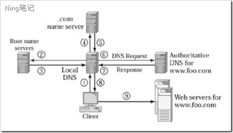

## 统一资源定位符 URL
Uniform Resource Locator

## 超文本传输协议  HTTP
Hypertext Transfer Protocol

## 互联网应用
- web
- streaming audio and video 可以缓冲，但是不能跳过 
- real-time audio and video 必须及时，打电话或者视频会议 300ms可以接受，100ms很及时

## circuit switched and packet switched. 
电路交换
分组交换 `store  and forward`

## 信息发送方式
- unicast 单播
- multicast 组播
- broadcast  广播

## 复用技术
-  synchronous time-division multiplexing (STDM). 同步时分复用技术，
to divide time into equal-sized quanta and, in a round-robin fashion, give each flow a chance to send its data over the physical link。    
> SHORTCOMING: 如果没有数据传输，则会产生很大的时间空闲。

-  frequency-division multiplexing (FDM). 频分多路复用
transmit each flow over the physical link at a different frequency,     
much the same way that the signals for different TV stations are transmitted at a different frequency over the airwaves or on a coaxial cable TV link.
> SHORTCOMING: 频率理论上有限的。

- 统计复用
first data from one flow is transmitted over the physical link, then data from another flow is transmitted。
statistical multiplexing has no mechanism to ensure that all the flows eventually get their turn to transmit over the physical link。
所以引出了分组交换，将一个大的信息拆分成小的分组，最后在目的地合并形成原始信息。

## support quality of service (QoS).
A network that attempts to allocate bandwidth to particular flows

## 网络传输中的几种错误
- 位丢失或者损坏，发生于外部因素，如闪电，电涌等。
- 整个包丢失，发生于转发错误或者不可修正的为错误导致需要整个包都要丢弃。
- 线路异常或者路由器/转换器异常

## 网络号和主机号
IP地址是以网络号和主机号来表示网络上的主机的，只有在一个网络号下的计算机之间才能“直接”互通，不同网络号的计算机要通过网关（Gateway）才能互通。
但这样的划分在某些情况下显得并不十分灵活。为此IP网络还允许划分成更小的网络，称为子网（Subnet），这样就产生了子网掩码。
子网掩码的作用就是用来判断任意两个IP地址是否属于同一子网络，这时只有在同一子网的计算机才能"直接"互通。那么怎样确定子网掩码呢？   

## Open Systems Interconnection (OSI) 开放式系统互联
1. The physical layer handles the transmission of raw bits over a communications link
2. The data link layer then collects a stream of bits into a larger aggregate called a frame. 
Network adaptors, along with device drivers running in the node's operating system, typically implement the data link level. This means that frames, not raw bits, are actually delivered to hosts.
3. The network layer handles routing among nodes within a packet-switched network.
At this layer, the unit of data exchanged among nodes is typically called a packet rather than a frame, although they are fundamentally the same thing. 
The lower three layers are implemented on all network nodes, including switches within the network and hosts connected to the exterior of the network
4. The transport layer then implements what we have up to this point been calling a process-to-process channel.
Here, the unit of data exchanged is commonly called a message rather than a packet or a frame. 
The transport layer and higher layers typically run only on the end hosts and not on the intermediate switches or routers
5. The session layer provides a name space that is used to tie together the potentially different transport streams that are part of a single application. 
For example, it might manage an audio stream and a video stream that are being combined in a teleconferencing application.
6. The presentation layer is concerned with the format of data exchanged between peer.
for example, whether an integer is 16, 32, or 64 bits long, whether the most significant byte is transmitted first or last, or how a video stream is formatted
7. The application layer. Application layer protocols include things like the Hypertext Transfer Protocol (HTTP), 
which is the basis of the World Wide Web and is what enables web browsers to request pages from web servers.

## NAT（Network Address Translation，网络地址转换）?
当在专用网内部的一些主机本来已经分配到了本地IP地址（即仅在本专用网内使用的专用地址），但现在又想和因特网上的主机通信（并不需要加密）时，可使用NAT方法。
这种方法需要在专用网连接到因特网的路由器上安装NAT软件。装有NAT软件的路由器叫做NAT路由器，它至少有一个有效的外部全球IP地址。这样，所有使用本地地址的主机在和外界通信时，都要在NAT路由器上将其本地地址转换成全球IP地址，才能和因特网连接。
另外，这种通过使用少量的公有IP 地址代表较多的私有IP 地址的方式，将有助于减缓可用的IP地址空间的枯竭

## DNS & CDN

- 1 客户端向local dns查询 www.foo.com，注意这是递归查询

- 2,3 local dns 向 root name servers(根服务器)  查询 .com 的（权威域名服务器）name server. 这里采用迭代方式。
      
- 4,5 local dns 向 .com 的 name server 查询 foo.com 的授权dns
      
- 6,7 local dns 向 foo.com 的授权dns得到 www.foo.com 的ip list
      
- 8 local dns 将 www.foo.com 的一个ip返回给客户端
      
- 9 客户端访问 ip 指向的服务器

CDN原理：通过`权威dns服务器来实现优质节点的选择，通过缓存来减少源站的`压力。

