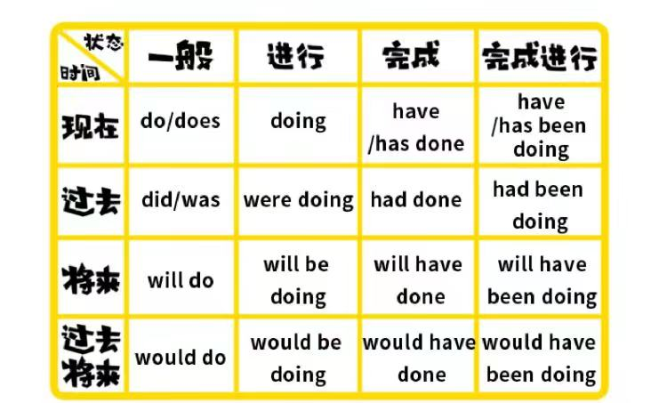
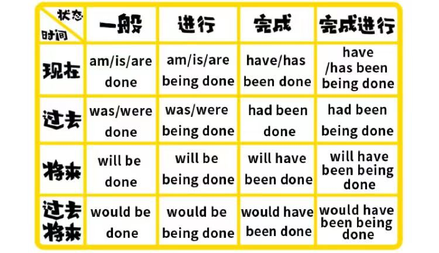

第十二段：理解时态。

时态，就是时间和状态。
时间有，过去，现在，未来(现在的未来)，过去未来，四种时间。
状态有一般式，进行式，完成式，完成进行式，四种状态。

比如说，eat，这个动词加上状态之后。
一般式，常吃eat，。
进行式，在吃，eating。
完成式，吃了，eaten。
完成进行式，一直在吃，been eating。

他们和四个时间杂交之后就是英语的十六个语法。

然而学习时态，可以先攻克状态，

第一种，一般式的例子。

例一，一般过去式，Leonardo DiCaprio was a handsome boy，wise boy who ate drumstick everyday。莱昂纳多曾经是是一个帅气和聪明的男孩，他每天都会吃鸡腿。
例二，一般现在式，Leonardo DiCaprio is a fleshy，wise boy who eats drumstick。莱昂纳多现在是一个聪明的胖男孩，现在仍然爱吃鸡腿。
例三，一般将来式，Leonardo DiCaprio will be a fleshy boy。莱昂纳多以后将会是一个胖胖的男孩子。

第二种，进行式的例子。

例一，过去进行式，Leonardo DiCaprio was eating drumstick when i saw him yesterday。我昨天看到莱昂纳多的时候，他在啃鸡腿。
例二，现在进行式，Leonardo DiCaprio is eating drumstick now。莱昂纳多现在正在吃鸡腿。
例三，将来进行式，i guess Leonardo DiCaprio will be eating drumstick when i see him tomorrow。我估计当我明天见到莱昂纳多的时候，他正在吃鸡腿。

第三种，完成式的例子。

例一，过去完成式，i had had diner when Leonardo DiCaprio invited me to go out to eat，昨天莱昂纳多请我出去吃饭的那会，我吃过饭了。
例二，现在完成式，i have had diner when Leonardo DiCaprio invites me to go out to eat，今天莱昂纳多请我出去吃烤鸡腿，我吃过饭了。
例三，将来完成式，i will have had diner when Leonardo DiCaprio invites me to go out to eat tomorrow，明天莱昂纳多请我吃饭的那会，我已经吃过饭了。

第四种，完成进行式的例子。

现在完成进行式，Leonardo DiCaprio has been looking for drumstick。莱昂纳多刚刚一直在找鸡腿。

理解英语的时态需要理解三点。

第一点，事件是什么时候发生的？
第二点，你是什么时候谈起这件事件的？
第三点，事件处于什么状态？完成了吗？在进行吗？

# 现在式
## 一般现在式
my name is Leonardo DiCaprio. 我的名字叫做莱昂纳多。
Football is played in most countries in the world. 玩足球的国家是最多的。
> explain：这是个一般现在式，也就是说，我的名字叫做莱昂纳多这件事是没有时间限制的。 

## 现在进行式
i am asking for help. 我在寻找帮助。
the sport meeting is being held in our school. 我校正在举办运动会。
> explain：这个是现在进行式，表示到说话这个是现在完成式的这一刻，时间还在进行，还没有结束。 

## 现在完成式的主动和被动
i have asked for help since the first time. 从第一次开始我就请求帮助。
this book has been translated in to many languages. 这本书已经被翻译为多国家语言。
> explain：这个是现在完成式，表示从过去的某一刻开始，直到现在，事情一直在发生。
 
I have been married for 3 years. 我已经结婚3年了。
> explain：have been done表延续，have done不能延续，have been married表示已婚这种状态，是可以延续的，have married只表示已经结婚，强调事实已经发生，是不能延续的。

## 现在完成进行式的主动和被动
> note：见文档[现在完成进行式](现在完成进行式%20present%20perfect%20progressive.md)

# 过去式
##  一般过去式的主动和被动
he refused the witch that night，and then he was turned into a beast.  那天晚上他拒绝了女巫，然后他就变成了一只野兽。
> explain：这个是一般过去式，说明在说话的这一刻，事情早已经结束，在时间轴上，永远的留在了过去。

This bridge was built in October last year. 这座桥是去年十月份建的。
This desk was made by my father. 这张桌子出自我爸爸之手。

##  过去进行式的主动和被动
the rain was beating on the windows，the wind was rising.
> explain：这个是过去进行式，说明在过去的某一刻，事情还在进行，还没有结束。

Trees were being planted by Jim at this time yesterday.

##  过去完成式的主动和被动
By nine o’clock last night,we had got 200 pictures from the spaceship.
Three books had been given to him by me. 

##  过去完成进行式的主动和被动
> 完成进行时均没有被动语态

I had been looking for it for days before I found it. 这东西我找了好多天才找着的。
Three books had been given to him by me. 

