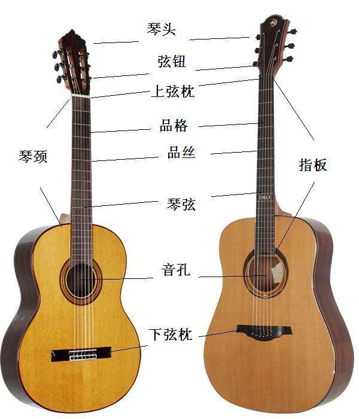
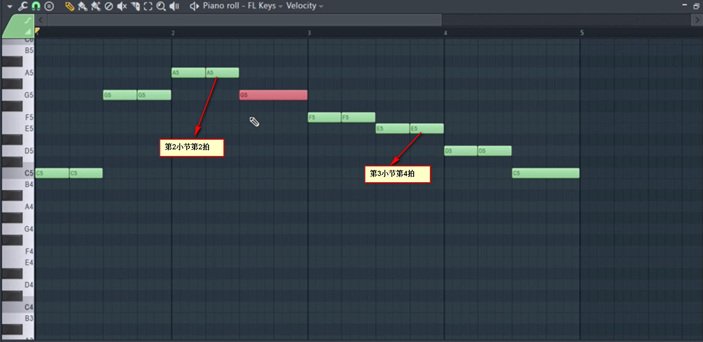
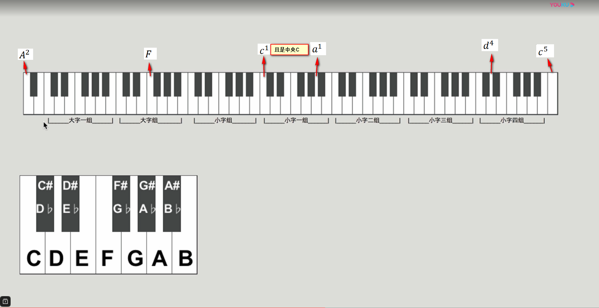
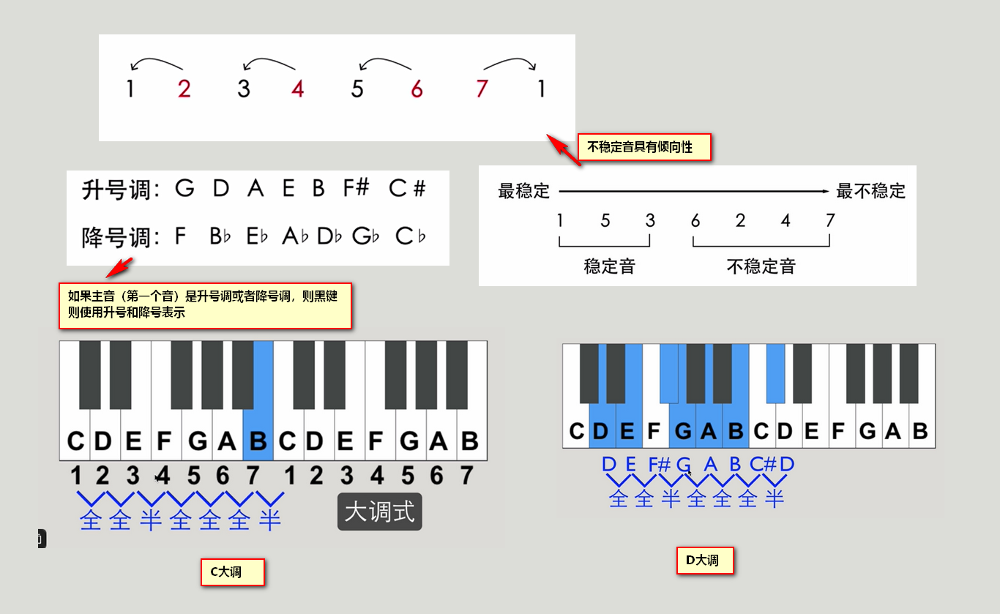
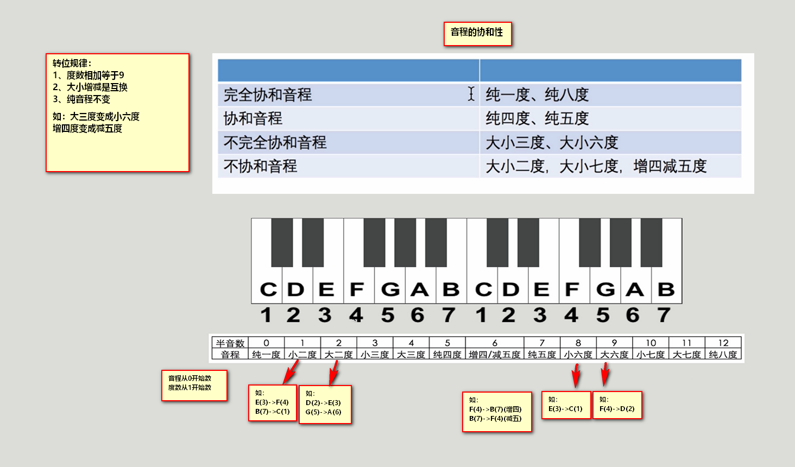
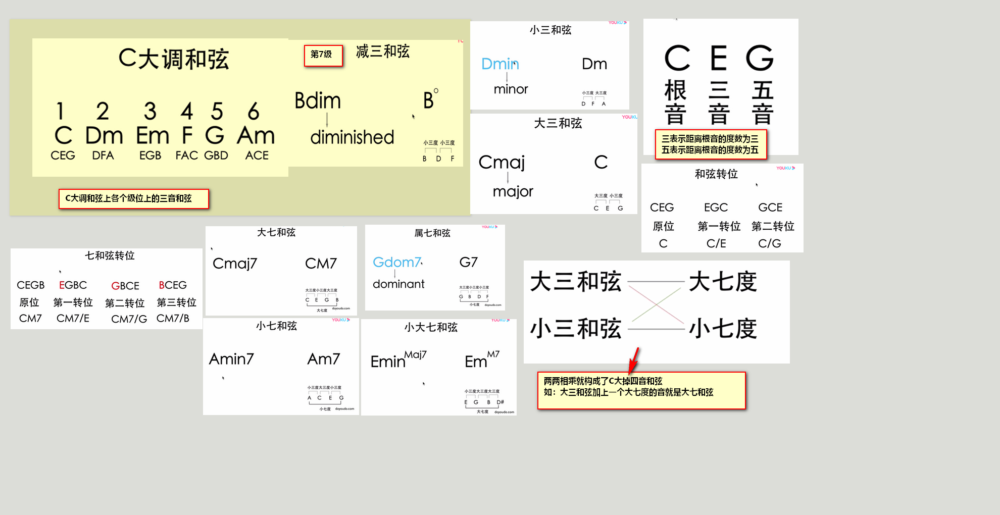
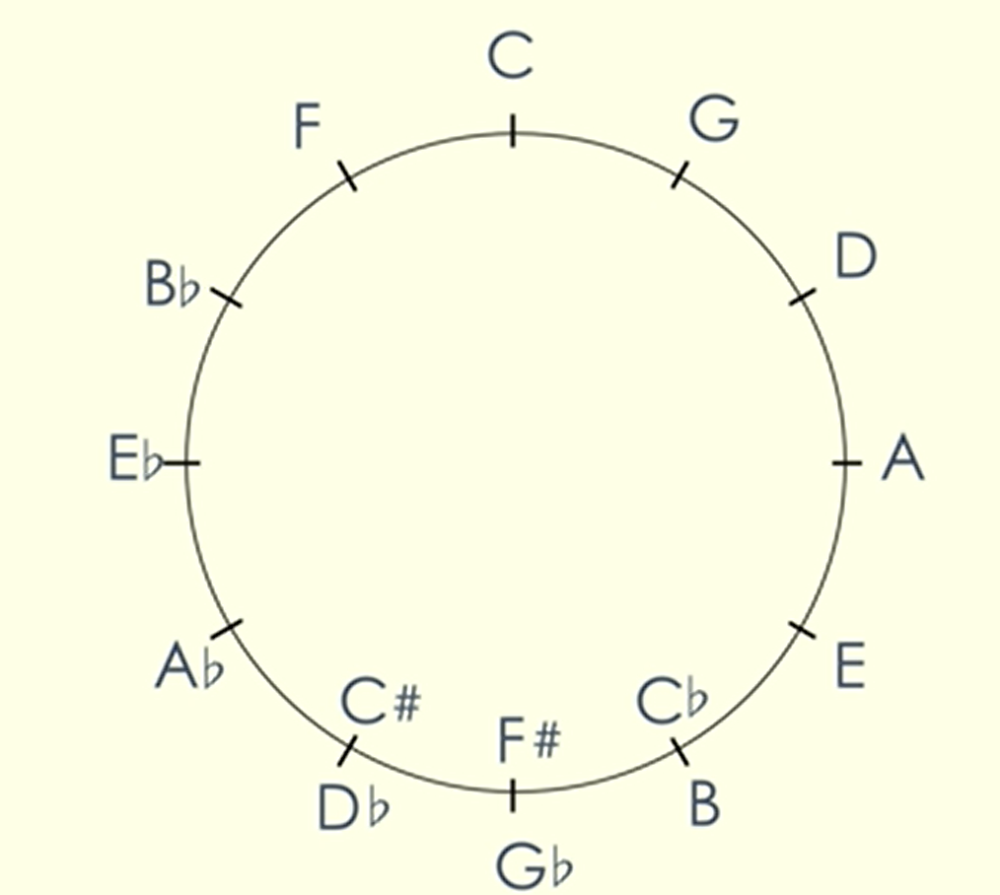
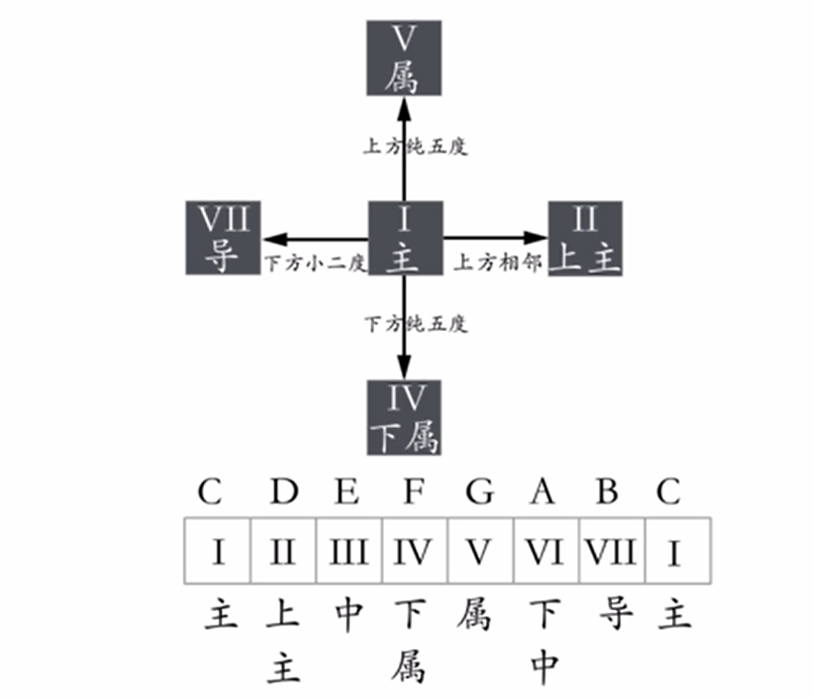
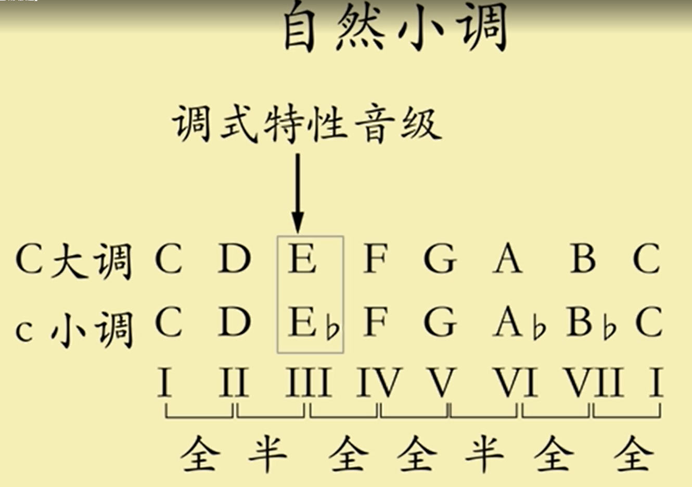

右手手指的代号为西班牙语的简写：
```
P—拇指(Pulgar)
i—食指(Indice)
m—中指(Medio)
a—无名指(Anular)
Ch—小指(Chico)
```


| do        | re      | mi        | fa        | sol     | la        | xi      |
|-----------|---------|-----------|-----------|---------|-----------|---------|
| C         | D       | E         | F         | G       | A         | B       |
| 1         | 2       | 3         | 4         | 5       | 6         | 7       |
| 5s3f（中音1） | 4s（中音2） | 4s2f（中音3） | 4s3f（中音4） | 3s（中音5） | 3s2f（中音6） | 2s（中音7） |
| -         | -       | -         | -         | -       | -         | -       |
| B->C      | C->D    | D->E      | E->F      | F->G    | G->A      | A->B    |
| xi->do    | do->re  | re>mi     | mi->fa    | fa->sol | sol->la   | la-xi   |
| 半         | 全       | 全         | 半         | 全       | 全         | 全       |


一品即为半音

| 1弦  | 2弦  | 3弦  | 4弦  | 5弦  | 6弦  |
|-----|-----|-----|-----|-----|-----|
| mi  | xi  | sol | re  | la  | mi  |
| E   | B   | G   | D   | A   | E   |
| 高音3 | 中音7 | 中音5 | 中音2 | 低音6 | 低音3 |

## 吉他结构



## 小节和节拍

G#：G sharp，读作升G

Bь：B flat，读作降B

4/4 分子代表每小节有4拍，分母代表4分（之一）音符为1拍。

4/8 分子代表每小节有4拍，分母代表8分（之一）音符为1拍。

6/8 分子代表每小节有6拍，分母代表8分（之一）音符为1拍，这就是常说的86拍。




## 琴盘介绍



## 大调式



## 音程



## 和弦



## 五度循环圈

为什么这么重视五度
因为距离五度音程的音特别协和，仅次于纯一度和纯八度音程的两个音。



## 调式中的名称

每个音都有自己的特点，比如导音有很强的倾向性（运动到主音）。
可以在后续进行学习。



## 自然小调

除了自然小调，还有旋律小调，和升小调


