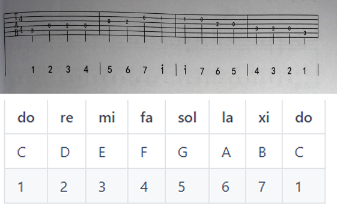
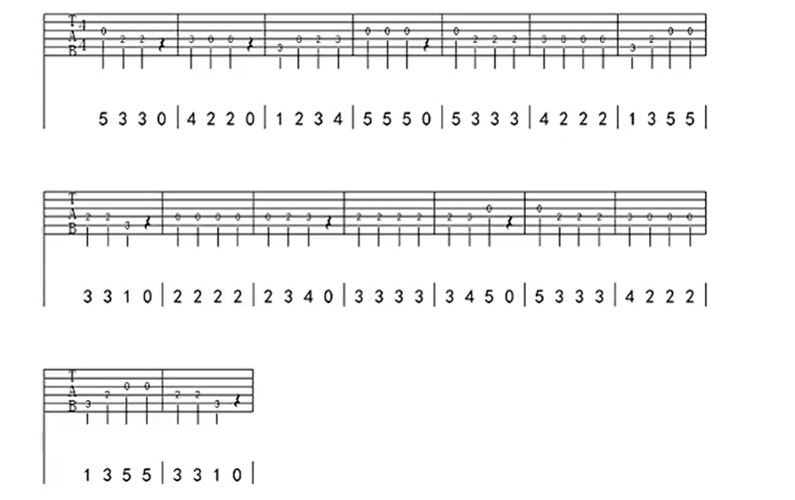
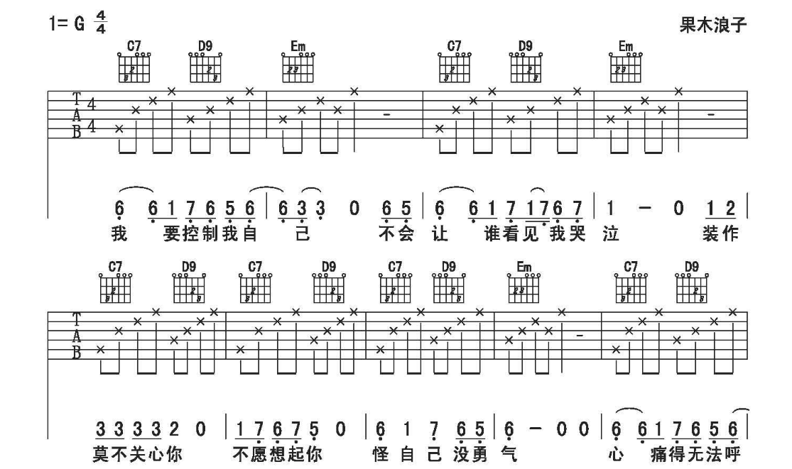

小蜜蜂

星语心愿[链接](http://www.emuban.com/article/aHR0cHM6Ly90aW1nc2EuYmFpZHUuY29tL3RpbWc%2FaW1hZ2UmcXVhbGl0eT04MCZzaXplPWI5OTk5XzEwMDAwJnNlYz0xNTg1MDI0NTk1NjgwJmRpPTNkYTdiODhmN2I0ZGViNjIyNjA1OWYxN2QyYWRhYjQwJmltZ3R5cGU9MCZzcmM9aHR0cCUzQSUyRiUyRmIuaGlwaG90b3MuYmFpZHUuY29tJTJGemhpZGFvJTJGcGljJTJGaXRlbSUyRmUxZmU5OTI1YmMzMTVjNjAwNTBlMzdhMThjYjFjYjEzNDg1NDc3ZTAuanBnQEDmsYLmnpzmnKjmtarlrZDnmoTmmJ%2For63lv4PmhL%2FlkInku5bosLEg5Y%2Bz5omL5oCO5LmI5by5PyDmr4%2Flj6Xor53lr7nlupRAQGl0YW7mmJ%2For63lv4PmhL%2FlkInku5bosLHorr7orqE%3D.html)

## 学习路径

基本拨弦 GET
谈七阶音 GET
谈七阶音曲目 GET
学习和弦 C G
学习和弦 Am Em
学习和弦 F
弹唱小情歌

学和弦学会看六线谱的各种符号

## 常用练习

爬梯子 练习按品
53231323 63231323 练习拨弦