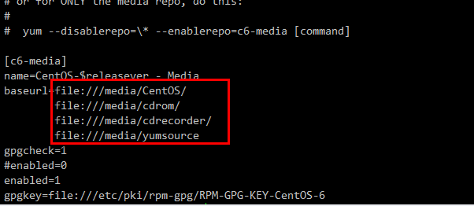
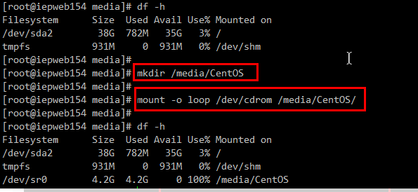

yum源是什么呢？我们安装软件的时候需要下载软件，将很多软件放在一起就是源。
软件安装包的来源。所以yum源就是软件安装包来源。如果我们是在线的，他会在网上给你下载安装包，如果是离线的没有网络。那么就只能配置本地的yum源了。

CentOS-Base.repo：有网的环境下默认使用这个，这个是第一优先级。因为没网，所以修改文件名，设置成备份文件。这样系统就会使用第二优先级的文件。
CentOS-Media.repo：没网的环境下使用这个，在上图中会发现他默认配置了4个路径，第4个yumsource是我自己加的。
意思是说，如果系统检测yum使用了离线安装，那么会从上到下从这4个路径中查找安装软件。
所以我们只要把光盘挂载在这四个目录下的任意一个目录即可。同时，该配置文件默认是不启用的，如果想使用需要修改倒数第二行的enabled为1，否则该文件无效。

挂载光盘或者u盘等使用的mount命令，但是你百度所有会说有挂在media目录下，也有挂载在mnt目录下的。这两个目录区别是什么呢？
media：挂载一些移动设备，例如光盘，U盘等。
mnt：挂载一些硬盘等设备。所以我们的光盘应该挂载在media目录下，从yum给的默认配置文件也能看出。

